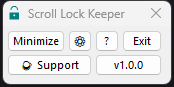
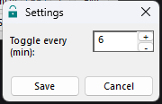
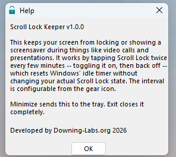
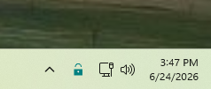

# Scroll Lock Keeper

A small, low-key Windows tray utility that keeps your screen from locking or
showing a screensaver during things like video calls and presentations.

It works by tapping **Scroll Lock** twice every few minutes -- toggling it
on, then back off -- which resets Windows' idle timer without changing your
actual Scroll Lock state. This is a real OS-level key injection (`SendInput`),
not a window-message trick, so it keeps working even while the app is
minimized to the tray.

This isn't meant to run all the time -- it's a deliberate, visible toggle for
situations like screen-shares and presentations, not a way to silently
disable Windows' lock screen as a matter of course.

## Screenshots

| Main window | Settings | Help |
|---|---|---|
|  |  |  |

Minimized, it lives quietly in the system tray:



## Features

- Toggles Scroll Lock twice every N minutes (configurable, default 4)
- Minimizes to the system tray with no taskbar clutter
- Single left-click the tray icon to restore the window
- Settings dialog to change the interval
- Checks GitHub Releases for a newer version and surfaces an "Upgrade"
  button on the main window when one's available

## Download

Grab the latest portable `.exe` from the
[Releases](https://github.com/downing-labs/scroll-lock-keeper/releases) page.
No installer -- just download and run. To run it at every login, copy the
`.exe` into your Windows Startup folder
(`shell:startup` in the Run dialog).

## Building from source

Requires the Rust GNU toolchain (not MSVC) plus a full MinGW-w64 install,
since `windows-rs`'s raw-dylib linking needs a real `dlltool`/`as` that
rustup's bundled minimal GNU linker doesn't include:

```powershell
rustup toolchain install stable-x86_64-pc-windows-gnu
rustup default stable-x86_64-pc-windows-gnu
winget install BrechtSanders.WinLibs.POSIX.UCRT
```

`.cargo/config.toml` points `dlltool` at a specific install path for this
machine. If you're building on a different machine, update that path to
wherever WinLibs installed (check `%LOCALAPPDATA%\Microsoft\WinGet\Packages\`).

```powershell
cargo build --release
```

## Updating the version

The version shown in the Help dialog and the title bar comes straight from
`Cargo.toml` (`CARGO_PKG_VERSION`) -- bump it there and it's consistent
everywhere automatically.

The **default** state of the main-window version button ("vX.Y.Z") is plain
button text and also follows `Cargo.toml` automatically. The **green
"Upgrade"** face, though, is a pre-rendered bitmap (`update_btn.bmp`) baked
in at build time -- Win32 buttons can't get a colored background without
owner-draw, so this was the practical workaround. That bitmap doesn't update
itself; regenerate it if it ever needs to change.

## License

MIT -- see [LICENSE](LICENSE).

## Support

If this saved you from getting auto-logged-out mid-presentation, consider
[buying me a coffee](https://ko-fi.com/hackpig1974).
